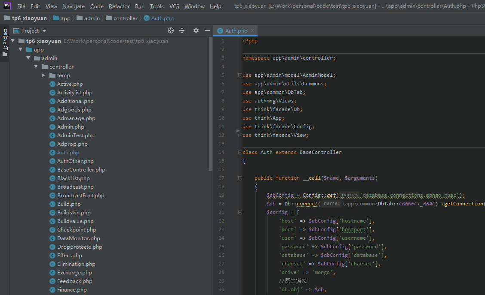
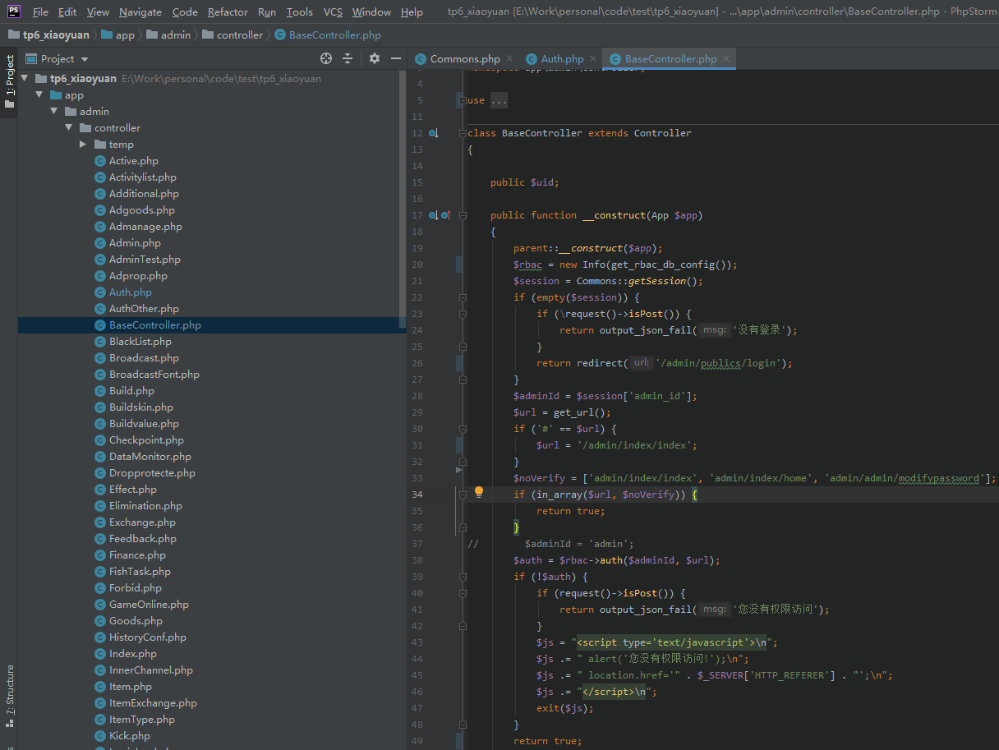
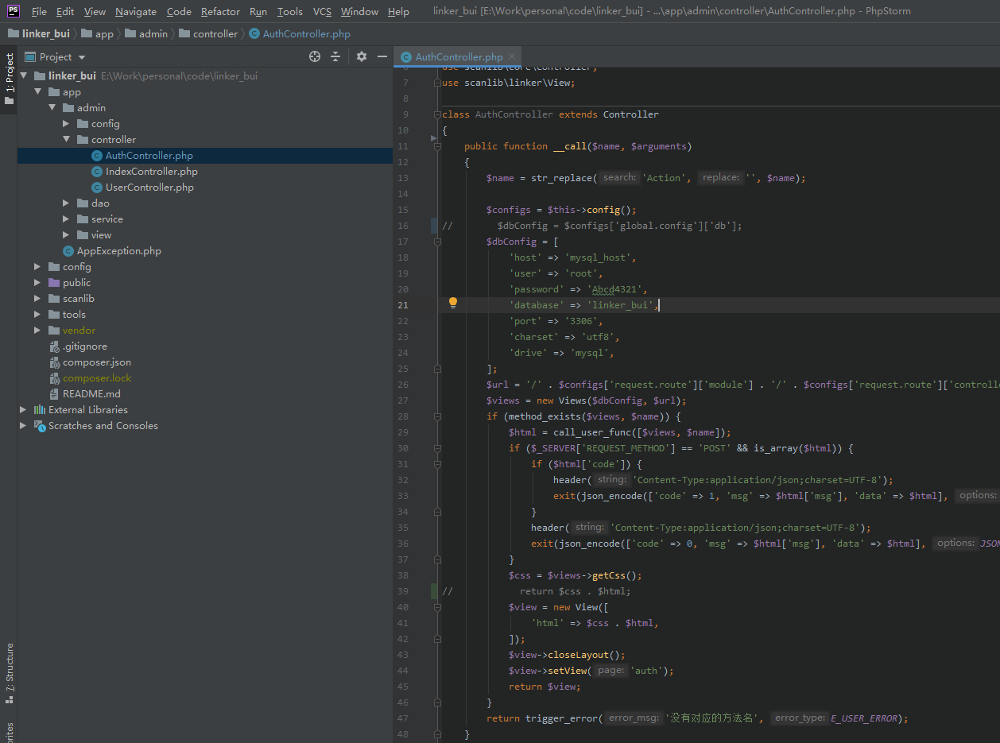
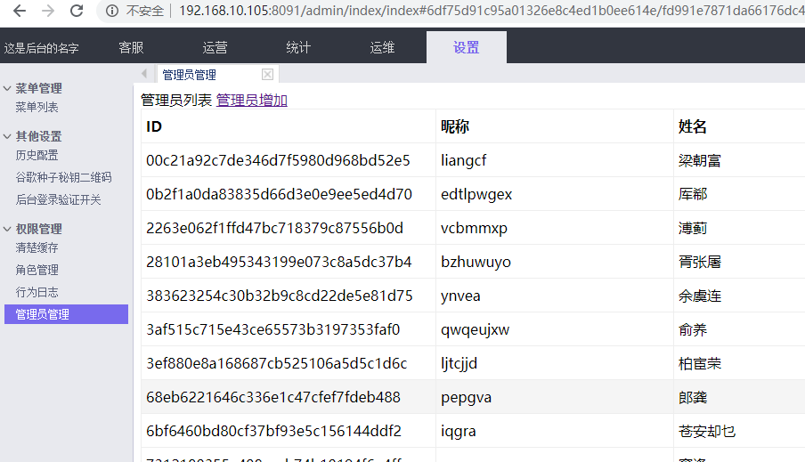

# simple_rbac

# 简单的rbac操作，包括管理员

菜单（Views）支持的方法有:
```
menu //菜单列表
menuAdd //添加菜单
role //角色列表
roleAdd //角色添加
authorize //角色授权
admin //管理员列表
adminAdd //管理员添加
roleAdmin //角色下的管理员
```


信息（Info）支持的方法主要是验证和登录以及管理菜单
```
auth //验证
login //登录
getMenu //管理员下的菜单，当getMenu方法参数是admin时会返回所有的显示的列表
```

数据库如果是mongodb和mysqli的话，可以使用主框架的链接，配置中多添加`'db.obj' => $db`配置就行；


使用举例
#### thinkphp6下的使用
大概结构


类似上面的结构，访问`http://127.0.0.1:8080/admin/auth/menu`就可以访问到列表
1、页面操作部分
```
public function __call($name, $arguments)
{
    $dbConfig = Config::get('database.connections.mongo_rbac');
    $db = Db::connect(\app\common\DbTab::CONNECT_RBAC)->getConnection()->connect();
    $config = [
        'host' => $dbConfig['hostname'],
        'port' => $dbConfig['hostport'],
        'user' => $dbConfig['username'],
        'password' => $dbConfig['password'],
        'database' => $dbConfig['database'],
        'charset' => $dbConfig['charset'],
        'drive' => 'mongo',//类型，支持mysql和mongo  mysql用的是mysqli扩展
        //原生链接
        'db.obj' => $db,
    ];

    $url = $this->request->root() . '/' . $this->request->controller();
    $views = new Views($config, $url);
//  $views = new Views(get_rbac_db_config(), $url);//get_rbac_db_config()方法是统一写好的获取配置方式，验证或者登录时候也需要
    if (method_exists($views, $name)) {
        $html = call_user_func([$views, $name]);
        if ($_SERVER['REQUEST_METHOD'] == 'POST' && is_array($html)) {
            if ($html['code']) {
                header('Content-Type:application/json;charset=UTF-8');
                exit(json_encode(['code' => 1, 'msg' => $html['msg'], 'data' => $html], JSON_UNESCAPED_UNICODE));
            }
            header('Content-Type:application/json;charset=UTF-8');
            exit(json_encode(['code' => 0, 'msg' => $html['msg'], 'data' => $html], JSON_UNESCAPED_UNICODE));
        }
        $css = $views->getCss();
        View::layout(false);
//      $css = $this->getCss();//可以自己配置自己的css样式
        View::assign('html', $css . $html);
        return View::fetch('auth');
//      return $css . $html;
    }
    return trigger_error('没有对应的方法名', E_USER_ERROR);
}
```
2、url验证部分
写了一个基类的统一验证方法

代码如下：
```
public function __construct(App $app)
{
    parent::__construct($app);
    $rbac = new Info(get_rbac_db_config());
    $session = Commons::getSession();
    if (empty($session)) {
        if (\request()->isPost()) {
            return output_json_fail('没有登录');
        }
        return redirect('/admin/publics/login');
    }
    $adminId = $session['admin_id'];
    $url = get_url();
    if ('#' == $url) {
        $url = '/admin/index/index';
    }
    $noVerify = ['admin/index/index', 'admin/index/home', 'admin/admin/modifypassword'];
    if (in_array($url, $noVerify)) {
        return true;
    }
//  $adminId = 'admin';
    $auth = $rbac->auth($adminId, $url);
    if (!$auth) {
        if (request()->isPost()) {
            return output_json_fail('您没有权限访问');
        }
        $js = "<script type='text/javascript'>\n";
        $js .= " alert('您没有权限访问!');\n";
        $js .= " location.href='" . $_SERVER['HTTP_REFERER'] . "';\n";
        $js .= "</script>\n";
        exit($js);
    }
    //可以做一下自己的逻辑，比如请求记录之类
    return true;
```
3、登录部分
登录部分可以自己读写，如果用Info类实例化就是需要传入数据配置文件


#### 其他框架或者应用的使用




1、权限管理页面操作
```
public function __call($name, $arguments)
{
    $name = str_replace('Action', '', $name);

    $configs = $this->config();
//  $dbConfig = $configs['global.config']['db'];
    $dbConfig = [
        'host' => 'mysql_host',
        'user' => 'root',
        'password' => 'Abcd4321',
        'database' => 'linker_bui',
        'port' => '3306',
        'charset' => 'utf8',
        'drive' => 'mysql',
    ];
    $url = '/' . $configs['request.route']['module'] . '/' . $configs['request.route']['controller'];
    $views = new Views($dbConfig, $url);
    if (method_exists($views, $name)) {
        $html = call_user_func([$views, $name]);
        if ($_SERVER['REQUEST_METHOD'] == 'POST' && is_array($html)) {
            if ($html['code']) {
                header('Content-Type:application/json;charset=UTF-8');
                exit(json_encode(['code' => 1, 'msg' => $html['msg'], 'data' => $html], JSON_UNESCAPED_UNICODE));
            }
            header('Content-Type:application/json;charset=UTF-8');
            exit(json_encode(['code' => 0, 'msg' => $html['msg'], 'data' => $html], JSON_UNESCAPED_UNICODE));
        }
        $css = $views->getCss();
//      return $css . $html;
        $view = new View([
            'html' => $css . $html,
        ]);
        $view->closeLayout();
        $view->setView('auth');
        return $view;
    }
    return trigger_error('没有对应的方法名', E_USER_ERROR);
}
```
2、验证和登录都是一样的，不做举例

效果是这样的


